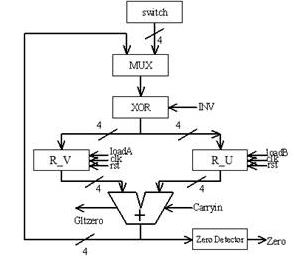
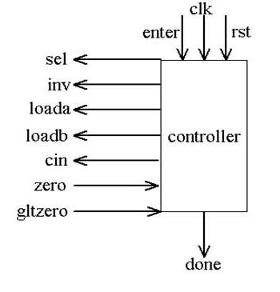
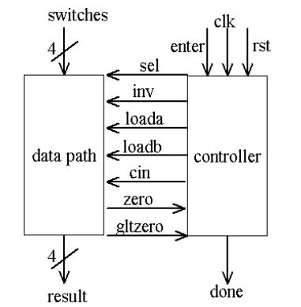

# GCDMachine
VHDL Coding on FPGA DE2 Board; Find GCD of two inputs.

## Summary
The project is implementation of GCD algorithm onto FPGA DE2-board written in VHDL.
The codes are written on 
```
Quartus II 13.0 Web Edition
```
Simulated on 
```
ModelSim - Altera
```
Programmed on to 
```
FPGA DE2 Board for testing
```

## Project Overview

### Data Path


### Controller


### Final Design

